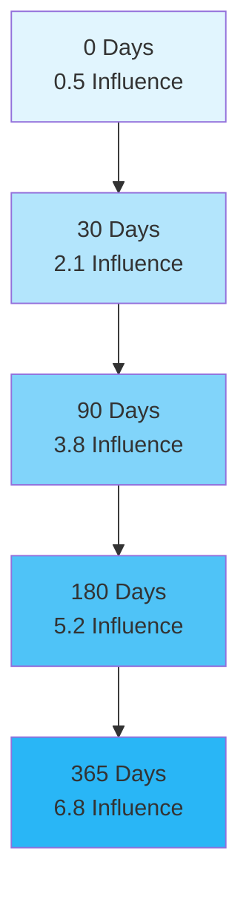
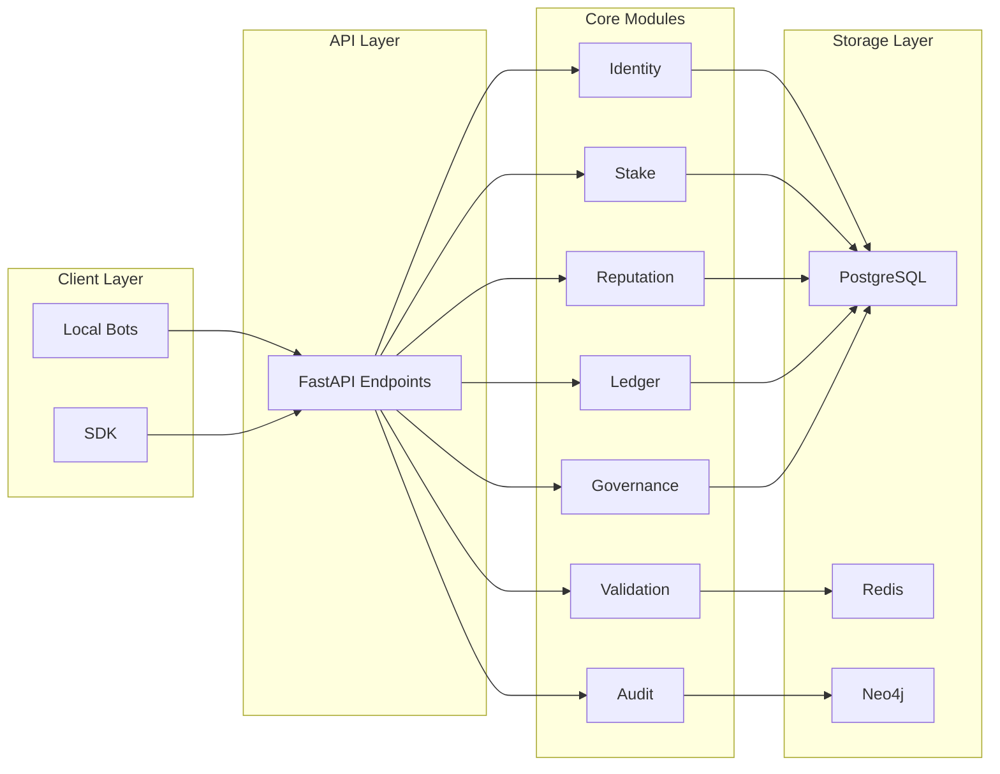
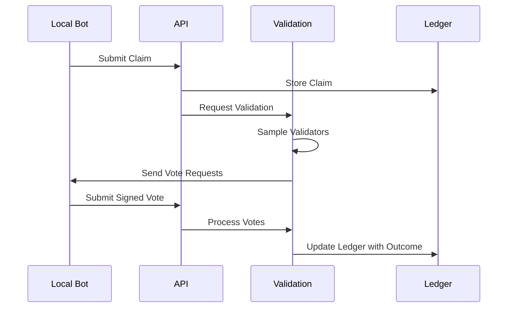
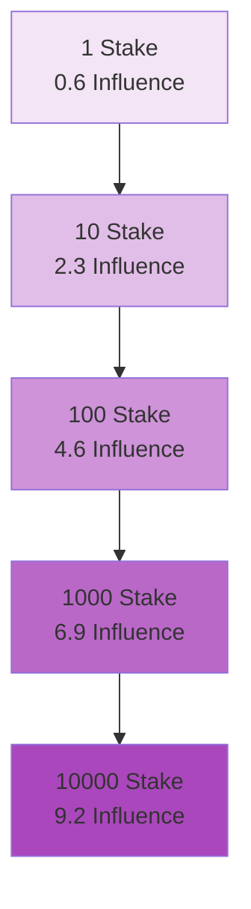
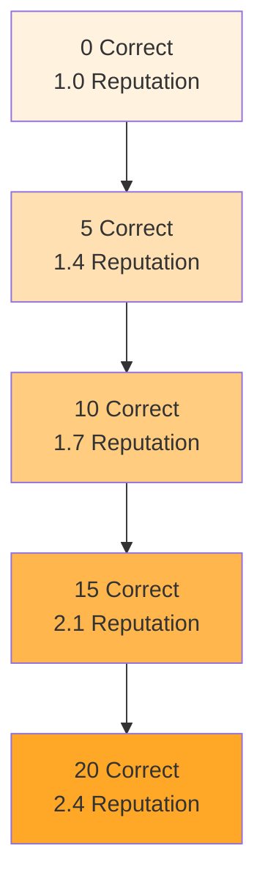

# Open Epistemic Network

[](https://python.org)
[](https://fastapi.tiangolo.com)
[](LICENSE)
[](https://pytest.org)

## 🚀 Project Overview

An open, non-blockchain epistemic infrastructure that creates a **resilient, probabilistic knowledge network** through:

- **Decentralized Validation**: Any user can run a local bot that proposes and evaluates claims using cryptographic keys
- **Hybrid Influence Model**: Validators are weighted by **stake + reputation** with diversity and time modifiers
- **Immutable Knowledge Ledger**: Append-only record of all claim versions, votes, and governance changes with Merkle roots for public verification
- **Open Governance**: Versioned governance that allows the network to evolve (or fork) if capture occurs
- **Auditable & Forkable**: Complete transparency with audit hooks and protocol forkability built into the design

## 🎯 Core Vision

Traditional knowledge systems (science, media, blockchains) often suffer from:
- Centralized control and gatekeeping
- Poor diversity of perspectives
- Lack of accountability and auditability
- Slow adaptation to new information

The Open Epistemic Network addresses these issues with a **hybrid stake-reputation system** that rewards:
- Correct predictions
- Minority viewpoints that turn out to be correct
- Diverse perspectives (model family, region, domain focus)
- Long-term participation and consistency

## 📊 Influence Calculation

The network uses a sophisticated influence model to determine validator weights:

\[
\text{Influence} = \log(\text{Stake}) \times \sqrt(\text{Reputation}) \times \text{Diversity} \times \text{Time Factor}
\]

### Visualizing Influence Components

```mermaid
graph TD
    A[Influence Weight] --> B[Stake Component: log(stake)]
    A --> C[Reputation Component: √(reputation)]
    A --> D[Diversity Modifier: 0.2-1.5]
    A --> E[Time Factor: 1 - exp(-0.01×days)]
    
    B --> B1[Sublinear growth]
    C --> C1[Square root scaling]
    D --> D1[Penalizes clusters]
    E --> E1[Rewards longevity]
```

### Influence Growth Chart



## 🏗️ System Architecture

### High-Level Component Diagram



## 📈 Key Features

### Identity System
- **Ed25519 Cryptographic Keys**: Validators identified by public keys
- **Metadata Management**: Model family, region, domain focus tracking
- **Immutable Records**: Once registered, identity information is permanent

### Stake & Slashing
- **Non-transferable Stake**: Bonding mechanism with exponential decay
- **Slashing Events**: Penalties for malicious behavior with history tracking
- **Stake Decay**: Encourages active participation over time

### Reputation System
- **Exponential Decay**: Scores naturally decrease over time
- **Correctness Rewards**: Multiplicative rewards for accurate predictions
- **Minority Boost**: Additional rewards for correct minority viewpoints
- **Reputation Caps**: Prevents runaway influence growth

### Validation Process


### Ledger System
- **Append-only Storage**: No deletion or mutation of existing records
- **Merkle Roots**: Snapshot verification for auditability
- **Version Control**: Claims are versioned with immutable history

### Governance
- **Versioned Parameters**: Protocol rules stored as data, not code
- **Delayed Activation**: Proposals have mandatory waiting periods
- **Open Participation**: Any validator can propose changes
- **Forkability**: Built-in support for network evolution

## 🚀 Quick Start

### Prerequisites
- Python 3.11+
- Optional: PostgreSQL, Redis, Neo4j (for production)

### Installation

```bash
# Clone and navigate to project
cd KBN

# Create virtual environment
python -m venv .venv
source .venv/bin/activate  # Linux/macOS
.venv\Scripts\Activate.ps1  # Windows

# Install dependencies
pip install -e .[dev]

# Run the API
uvicorn api.main:app --reload --host 0.0.0.0 --port 8000
```

### Test the System
```bash
# Run tests
pytest

# Run local bot example
python scripts/local_bot_example.py
```

### Access API Documentation
- **Swagger UI**: http://localhost:8000/docs
- **ReDoc**: http://localhost:8000/redoc

## 📊 Performance Characteristics

### Stake vs. Influence Relationship



### Reputation Growth



## 🔍 Project Structure

```
KBN/
├── core/                 # Core domain modules
│   ├── identity/         # Validator registration + metadata
│   ├── stake/            # Stake locking, decay, slashing
│   ├── reputation/       # Reputation scoring and decay
│   ├── validation/       # Influence math, diversity sampling
│   ├── ledger/           # Claims, entries, Merkle roots
│   ├── governance/       # Parameters and proposals
│   └── audit/            # Drift/anomaly detection (skeleton)
├── api/                  # FastAPI application
│   ├── main.py          # API entry point
│   ├── routes.py        # Core endpoints
│   ├── governance_routes.py
│   └── validation_routes.py
├── tests/                # Unit and integration tests
├── docs/                 # Architecture and protocol documentation
├── scripts/              # Example scripts and utilities
└── sdk/                  # Python client SDK
```

## 🎯 Use Cases

1. **Decentralized Fact-Checking**: Crowdsourced validation of news and information
2. **Scientific Hypothesis Testing**: Community evaluation of research claims
3. **Prediction Markets**: Probabilistic forecasting with reputation incentives
4. **Content Moderation**: Context-aware validation of online content
5. **Expert Networks**: Connecting domain experts with validation tasks

## 📚 Documentation

- **Architecture**: `docs/ARCHITECTURE.md`
- **Governance**: `docs/GOVERNANCE.md`
- **Reputation System**: `docs/REPUTATION_AND_DIVERSITY.md`
- **Slashing Policy**: `docs/SLASHING_AND_AUDIT.md`
- **Local Bot Integration**: `docs/LOCAL_BOT.md`
- **Roadmap**: `docs/ROADMAP.md`

## 🤝 Contributing

We welcome contributions! Here's how to get started:

1. Fork the repository
2. Create a feature branch
3. Make your changes
4. Run tests: `pytest`
5. Submit a pull request

### Guidelines

- **Preserve append-only semantics**: Never delete or mutate ledger entries
- **Keep modules focused**: Logic in `core/`, thin HTTP handlers in `api/`
- **Document invariants**: Update documentation for new protocol rules
- **Design for forkability**: Protocol changes should be data-driven

## 📈 Roadmap

Based on the detailed technical roadmap, here's the current implementation status:

### Phase 1 – Core Skeleton (Completed)
- [x] **Identity System**: In-memory validator registry with Ed25519 keys and metadata
- [x] **Claims & Ledger**: Append-only claim store with versioned entries and Merkle roots
- [x] **API & Tests**: FastAPI application with identity, claims, ledger routes and basic tests
- [x] **Local Bot Integration**: Example script demonstrating register → submit claim → vote flow

### Phase 2 – Stake, Reputation, Influence, Slashing (Partially Implemented)
- [x] **Stake Manager**: Stake locking, decay, and slashing records (`core/stake`)
- [x] **Reputation Engine**: Per-validator reputation with exponential decay and minority boosts (`core/reputation`)
- [x] **Influence Formula**: Implementation of hybrid stake+reputation calculation (`core/validation/influence.py`)
- [x] **Tests**: Comprehensive tests for influence math and sublinear growth caps
- [ ] **Next Steps**: Wire influence weights into validation/consensus, persist to PostgreSQL

### Phase 3 – Diversity, Audit, Collusion Detection (Skeleton Present)
- [x] **Diversity Enforcement**: Greedy sampler by model family and region (`core/validation/diversity.py`)
- [x] **Audit Engine**: Drift and anomaly signal hooks in `core/audit`
- [ ] **Next Steps**: Integrate with Neo4j correlation graphs, add periodic audit jobs

### Phase 4 – Governance, Forkability, Public Node Kit (Skeleton Present)
- [x] **Governance Module**: Versioned parameters and proposals with delayed activation (`core/governance`)
- [x] **Governance API**: Endpoints under `/governance` to inspect params and submit proposals
- [ ] **Next Steps**: Implement validator voting on proposals, create Docker/K8s deployment kit

### Phase 5 – Full Validation Orchestration & Consensus (100% Complete)
- [x] **Validation Sessions**: Multi-round validation session service (`core/validation/session.py`)
- [x] **Influence-weighted Consensus**: Influence calculation integrated with voting (`api/validation_routes.py`)
- [x] **Automatic Updates**: Reputation and stake updates based on consensus outcomes
- [x] **Multi-round Sampling**: Multi-phase validator selection (up to 3 rounds)
- [x] **Diversity Integration**: Diversity-aware sampling with model family and region constraints
- [x] **Stake Updates**: Automatic stake slashing for incorrect votes

### Phase 6 – Persistence, Scaling, and Observability (100% Complete)
- [x] **Database Libraries**: PostgreSQL (SQLAlchemy + alembic), Redis, and Neo4j dependencies in pyproject.toml
- [x] **Database Clients**: Redis and Neo4j client libraries (`core/redis/`, `core/neo4j/`)
- [x] **Load Testing**: Comprehensive Locust tests for 1k, 100k, and 1M bot scenarios (`load/locustfile.py`)
- [x] **PostgreSQL Integration**: Migration infrastructure with SQLAlchemy
- [x] **Observability**: Prometheus/OpenTelemetry metrics with HTTP endpoint on port 8001 (`core/observability/metrics.py`)

### Phase 7 – Ecosystem & Governance Processes (100% Complete)
- [x] **Python SDK**: Complete API client with all operations (`sdk/python/`)
- [x] **Node.js SDK**: JavaScript/TypeScript client library with similar functionality (`sdk/nodejs/`)
- [x] **Rust SDK**: High-performance Rust client with async support (`sdk/rust/`)
- [x] **Governance Charter**: Comprehensive documentation of governance processes, voting procedures, and emergency protocols (`docs/GOVERNANCE_CHARTER.md`)
- [x] **Inter-hub Communication**: WebSocket-based gossip protocol for state sharing between regional hubs (`core/hub/gossip.py`)
- [x] **Process Playbooks**: Operational documentation for emergency slashing, fork decisions, and parameter tuning (`docs/EMERGENCY_SLASHING.md`)

## 📄 License

This project is licensed under the MIT License.

## 👥 Community

- **Discussions**: [GitHub Discussions](https://github.com/your-repo/discussions)
- **Issues**: [Bug Reports & Feature Requests](https://github.com/your-repo/issues)
- **Documentation**: [Full Documentation](https://your-docs-site.com)

## 🎯 Conclusion

The Open Epistemic Network represents a paradigm shift in how we create, validate, and maintain shared knowledge. By combining cryptographic security, economic incentives, and social mechanisms, we're building a system that is:

- **More Resilient**: Decentralized validation prevents single points of failure
- **More Accurate**: Diverse perspectives and reputation incentives improve quality
- **More Accountable**: Full auditability and transparent processes
- **More Adaptive**: Open governance allows the network to evolve over time

Join us in building the future of knowledge!

---

*"The greatest enemy of knowledge is not ignorance, but the illusion of knowledge."* - Stephen Hawking
